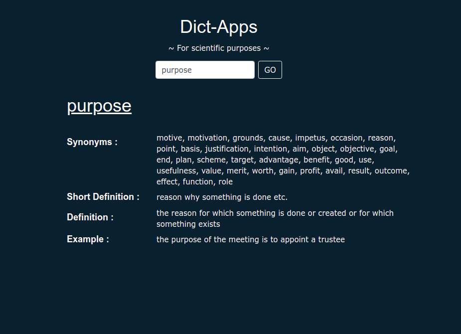

# Dictionary Apps to help me find out synonyms of a word.

This repository contains documentation about Dictionary Apps contains synonyms, short definition, definition, and usage example of a word.
All sources are developed by using Django Framework, run Docker, then push to Heroku.

There are 'dictapp' repo as a main repo here.

################################################################

## dictapp ---- this contains Dictionary App configuration.

This app still in supports for further development in the future

------------------- For development -----------------------------

- build environment
- activate environment
- use latest python and pip version for runtime
- run "pip install -r requirements.txt"
- run "python manage.py runserver", default port is 8000

------------------- For heroku deployment -----------------------

- follow instruction on heroku deployment with container registry

################################################################

## Attachment

Got to Apps Demo [here](https://dictionary-app-v1.herokuapp.com/ "go to link")
